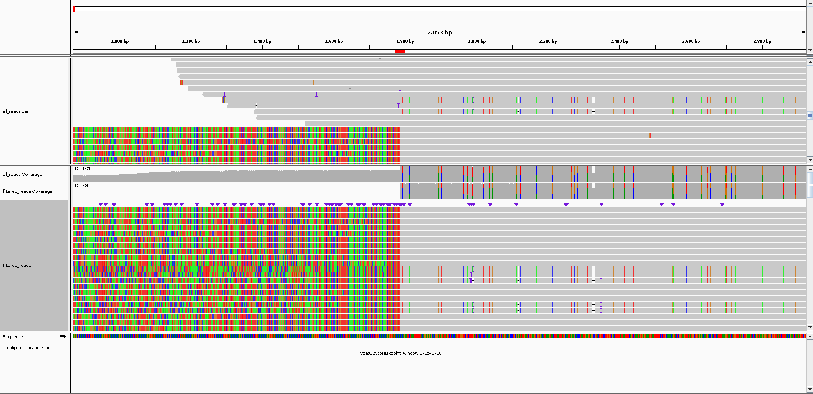

## Terminology: breakpoint types and strandedness

- **Breakpoint type**:
  - S2G: telomere-containing softclipped-reads align to a location in the genome
  - G2S: non-telomere-containing softclipped-reads align to a location in the genome 
    that contains telomeres
  
  These two types both describe elimination breakpoints at which telomeres have been 
  added to the retained fragments. In the case of `S2G` breakpoints, the assembled 
  genome is the unbroken genome, and breakpoint-supporting reads come from cells 
  with a broken genome. In the case of `G2S` breakpoints, the assembled genome is 
  the reduced genome (with telomeres), and breakpoint-supporting reads come from cells 
  with an unbroken genome

- **Breakpoint strand**: 
  - '+', or also called '3prime', if the softclips on reads occur 3' of the assembled genome 
  - '-' or '5prime', if they occur 5' of the assembled genome 

  For both `S2G` and `G2S` breakpoints, '+' suggests the eliminated genome occurs 3' of the identified breakpoint, and vice-versa.

## Output files in detail

- `breakpoint_locations.bed`: a BED-formatted file containing the location of identified 
   elimination breakpoints.
   - The location (columns 1,2 and 3) is provided as an interval of size one, and is defined
     as the first eliminated base past the putative breakpoint. If multiple 
     putative breakpoints have been clustered, the single location with the maximal read support 
     is used.
   - The name column (column 4) records the breakpoint type, as defined above. 
     It also stores a larger window, in the format `breakpoint_window: <start>-<end>`.
     This contains all putative breakpoint positions with >=`--min_supporting_reads` read support, 
     and located within `--clustering_threshold` of each other. 
   - The score column (column 5) stores the number of sequencing reads that support 
     the breakpoint.
   - The strand column (column 6) specifies the likely direction of eliminated DNA, 
      as defined above.
      
- `breakpoint_sequences.fasta`: a FASTA-formatted file containing the sequences 
   of identified elimination breakpoints. The header field contains:
   - A sequence ID as `<breakpoint_type>_<breakpoint_direction>_<chrom>`

     `breakpoint_type`: 'S2G' or 'G2S', as defined above

     `breakpoint_type`: '5prime' or '3prime', as defined above

     `chrom`: the contig/scaffold/chromosome name

    - Some additional information is provided, e.g. the position of the breakpoint 
      and the number of reads supporting the breakpoint ('num_telo_containing_softclips')

- `breakpoint_foci_<breakpoint_type>.tsv`: a tab-separated-value file containing the 
   location of all putative breakpoints, the read support for each breakpoint (in both 
   forward and reverse orientation), and the total read depth at the putative breakpoint, 
   plus in a window around each breakpoint. This file enables assessing how sharp 
   a breakpoint is, and accessing all the individual breakpoints that may have been 
   clustered in `breakpoint_locations.bed`.

## Applications

### Assembling past somatic telomeres

The 'G2S' breakpoints in the output BED of `delfies` indicate locations at which 
the genome assembly stops at telomeres of the reduced genome (in 
species that undergo Programmed DNA Elimination, this is the somatic genome). 

I provide a script in `scripts/deplete_G2S_reads.sh` for removing from your input BAM the 
reads that support these somatic telomeres. Re-assembling the 'soma-depleted' reads only
allows extending past them and assembling a more complete genome.

Here is an example of reads aligned to a G2S breakpoint, before and after running 
the G2S read depletion script:

The genome sequence at the bottom has telomere arrays assembled 5' of an identified G2S 
breakpoint by `delfies`. The alignments in the top panel contain a mixture of 'reduced' (telomere-containing, 
i.e. matching the assembled genome) and 'complete' reads (softclips where the telomeres are 
in the genome). The alignments in the bottom panel contain 'complete' reads only. These 
can be assembled to 'force' the genome assembler not to stop at the reduced genome.
